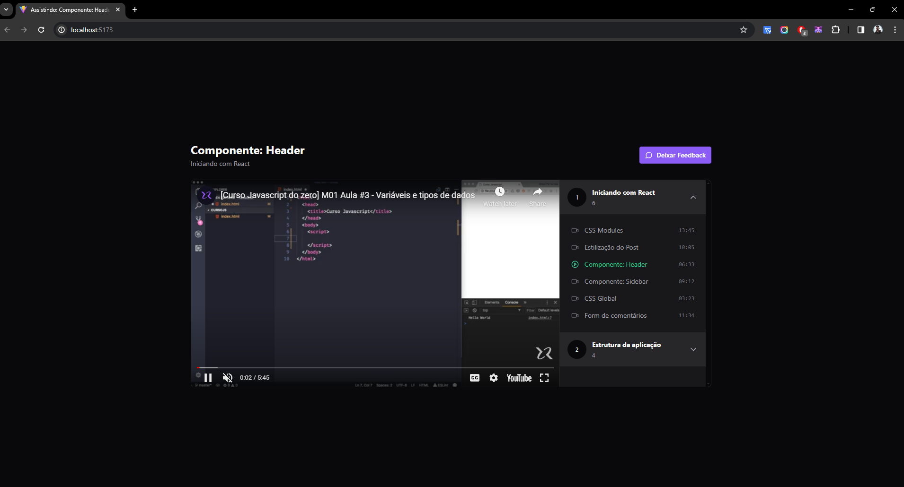

<h1 align='center'>Redux | Zustand</h1>

<h1 align="center">
  
</h1>

## About 🚀

This project was built to get knowledge about the Redux and Zustand .

---

## Techs ✔
- [React JS](https://reactjs.org/)
- [Vite](https://vitejs.dev/)
- [Tailwind CSS](https://tailwindcss.com/)
- [Typescript](https://www.typescriptlang.org/)
- [Redux Toolkit](https://redux-toolkit.js.org/)
- [Zustand](https://zustand-demo.pmnd.rs/)

---

## How to install 💻

```bash
#First clone this project on your preference path

$ git clone https://github.com/Luan4560/Ignite-lab.git

# Then got to you path, open the project and install the dependecies.

$ yarn or npm install

# After that, just initilialize the project with:

$ yarn dev
```
---

This project was made by Luan Nascimento 🤘 and provides
for event Ignite Lab by [Rocketseat](https://rocketseat.com.br/) 🚀

## Check result on

```https://ignite-hi92h2pyq-luan4560.vercel.app/```
